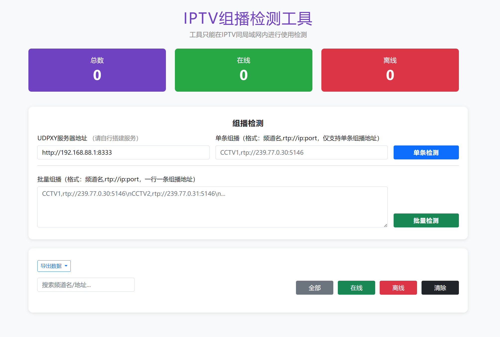
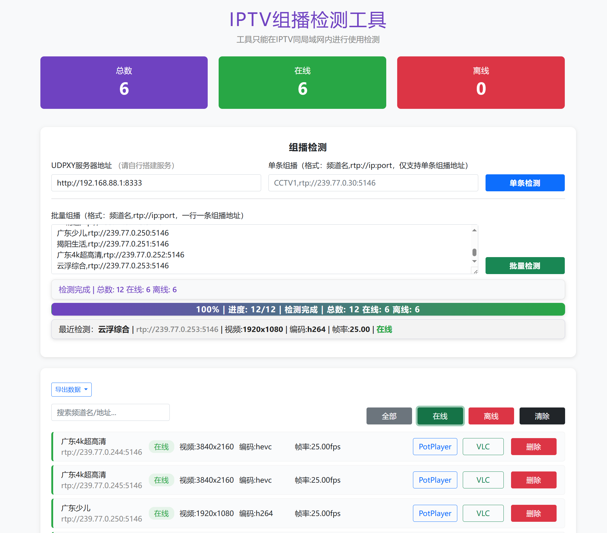

# 📺 Iptv-web-Checker



🏷️ 版本号：v1.0.0  

---

## 🌟 项目简介

Iptv-web-Checker 是一款基于 Node.js + Express + ffprobe 的 IPTV 组播流检测与管理工具，提供现代化 Web 界面，支持批量检测、状态筛选、导出等功能，适用于 IPTV 网络环境下的组播流批量检测、维护和导出。

---

## ⚡ 软件功能说明

- 🔍 **批量检测**：支持批量导入 IPTV 组播流地址，自动检测每路流的在线状态、分辨率、编码、帧率等信息
- 🎯 **单条检测**：可单独检测某一路组播流
- 🔄 **状态筛选**：可按"全部/在线/离线"筛选显示检测结果
- 🔎 **搜索功能**：支持按频道名或地址模糊搜索
- 📤 **导出功能**：
  - 📝 TXT 格式：频道名称,rtp://ip:端口，每行一条
  - 📋 M3U 格式：标准 M3U，地址为 UDPXY服务器/rtp/ip:端口
  - 💡 导出前弹窗说明格式，M3U分组请用EPG软件
- 🗑️ **删除/清空**：支持单条删除和一键清空所有检测结果
- 📊 **统计信息**：实时显示总数、在线、离线数量
- 🎨 **美观UI**：响应式设计，适配 PC 和移动端

---

## 🛠️ 实现方式

- 🔧 **后端**：Node.js + Express，调用 ffprobe 命令行工具检测流媒体信息，缓存检测结果提升性能
- 🎯 **前端**：原生 HTML+CSS+JS，Bootstrap 5 美化界面，AJAX 与后端交互
- 💾 **数据存储**：检测结果存储于内存，重启服务后会清空

---

## 本地部署说明

### 1. 环境准备
- Node.js 16 及以上（建议使用 LTS 版本，推荐 Node.js 18.x）
- ffprobe（建议安装 ffmpeg 套件，确保 ffprobe 命令可用，Windows/Linux 通用）
- 建议使用 Chrome、Edge、Firefox 等现代浏览器访问

### 2. 下载源码

```bash
# Windows 示例
cd C:\Users\Administrator\Desktop
# Linux 示例
cd ~/your/path/
git clone <本项目地址> Iptv-web-Checker
cd Iptv-web-Checker
```

### 3. 安装依赖

```bash
npm install
```

#### 常见错误及解决办法：
- **npm install 报错**：
  - 请检查 Node.js 是否正确安装，可用 `node -v` 和 `npm -v` 检查版本。
  - 若提示权限问题，Windows 请用管理员身份运行 PowerShell，Linux 可尝试 `sudo npm install`。
- **ffprobe 未找到**：
  - Windows：请下载 [ffmpeg 官网](https://ffmpeg.org/download.html) 的 Windows 版本，解压后将 ffprobe.exe 所在目录加入系统环境变量 PATH。
  - Linux：可用 `sudo apt install ffmpeg` 或 `sudo yum install ffmpeg` 安装。
  - 安装后在命令行输入 `ffprobe -version` 能正常输出版本信息即可。

### 4. 启动服务

#### Windows
```powershell
npm start
```

#### Linux
```bash
npm start
```

- 启动后，终端会显示 `服务器运行在 http://localhost:3000`。
- 默认监听 3000 端口，如需修改请编辑 `src/index.js` 的 `port` 变量。

#### 常见错误及解决办法：
- **端口被占用**：
  - 报错 `EADDRINUSE: address already in use`，请更换端口或关闭占用 3000 端口的程序。
- **ffprobe 相关错误**：
  - 检查 ffprobe 是否安装并在 PATH 中。
  - 检查防火墙或杀毒软件是否拦截 ffprobe。
- **UDPXY 无法访问**：
  - 请确保 UDPXY 服务已启动，且 Web 页面填写的 UDPXY 地址正确可访问。

### 5. 访问 Web 页面
- 启动后在浏览器访问：http://localhost:3000
- 局域网其他设备可通过本机 IP 访问（如 http://192.168.1.100:3000），需保证防火墙放行 3000 端口。

### 6. 配置 UDPXY
- 请确保本地或局域网内有可用的 UDPXY 服务，并在页面填写 UDPXY 地址（如：http://192.168.88.1:8333）。
- UDPXY 是 IPTV 组播转 HTTP 的服务，需自行搭建。

---

## 🐳 Docker 部署说明

### 📦 方式一：使用 GitHub Container Registry（国外推荐）

拉取和运行镜像：
```bash
# 拉取镜像
docker pull ghcr.io/cgg888/iptv-web-checker:1.0.0

# 运行容器（默认端口 3000）
docker run -d -p 3000:3000 --name iptv-checker ghcr.io/cgg888/iptv-web-checker:1.0.0

# 如果要使用其他端口（例如 8080），可以：
docker run -d -p 8080:3000 --name iptv-checker ghcr.io/cgg888/iptv-web-checker:1.0.0
```

### 📦 方式二：使用阿里云容器镜像（国内推荐）

拉取和运行镜像：
```bash
# 拉取镜像
docker pull registry.cn-hongkong.aliyuncs.com/cgg888/iptv-web-checker:1.0.0

# 运行容器（默认端口 3000）
docker run -d -p 3000:3000 --name iptv-checker registry.cn-hongkong.aliyuncs.com/cgg888/iptv-web-checker:1.0.0

# 如果要使用其他端口（例如 8080），可以：
docker run -d -p 8080:3000 --name iptv-checker registry.cn-hongkong.aliyuncs.com/cgg888/iptv-web-checker:1.0.0
```

### 🚢 方式三：使用 Docker Compose（推荐）

1. 创建 docker-compose.yml 文件：
```bash
# 创建项目目录
mkdir iptv-checker && cd iptv-checker

# 创建 docker-compose.yml 文件并编辑
nano docker-compose.yml  # 或者使用其他编辑器
```

2. 选择一个镜像源，将以下内容粘贴到 docker-compose.yml（二选一）：

GitHub 版本：
```yaml
services:
  iptv-checker:
    image: ghcr.io/cgg888/iptv-web-checker:1.0.0
    container_name: iptv-checker
    ports:
      - "3000:3000"
    environment:
      - NODE_ENV=production
      - TZ=Asia/Shanghai
    volumes:
      - ./data:/app/data
      - ./logs:/app/logs
    restart: unless-stopped
```

阿里云版本：
```yaml
services:
  iptv-checker:
    image: registry.cn-hongkong.aliyuncs.com/cgg888/iptv-web-checker:1.0.0
    container_name: iptv-checker
    ports:
      - "3000:3000"
    environment:
      - NODE_ENV=production
      - TZ=Asia/Shanghai
    volumes:
      - ./data:/app/data
      - ./logs:/app/logs
    restart: unless-stopped
```

3. 🚀 启动服务：
```bash
docker-compose up -d
```

4. 📋 查看日志：
```bash
docker-compose logs -f
```

5. ⏹️ 停止服务：
```bash
docker-compose down
```

#### 💡 常见问题
1. 🔄 如果端口被占用，修改端口映射（例如："8080:3000"）
2. 🔒 如果拉取失败，检查 Docker 登录状态
3. 🌐 国内用户如果 GitHub 镜像拉取较慢，建议切换到阿里云镜像
4. 📋 查看实时日志：`docker-compose logs -f`
5. 🔄 重启容器：`docker-compose restart`
6. ⬆️ 更新镜像：`docker-compose pull && docker-compose up -d`


#### 6 注意事项
- ✅ 确保系统已安装 Docker 和 Docker Compose
- 🔐 使用 GitHub 镜像源需要先登录 ghcr.io
- 🚀 国内用户建议使用阿里云镜像源，速度更快
- 🔌 容器默认监听 3000 端口
- 📦 镜像大小约 200MB，采用 Alpine Linux 基础镜像
- 🎥 内置 ffmpeg，无需额外安装
- 🔒 如果使用 GitHub Container Registry，首次拉取可能需要登录：
  ```bash
  echo $GITHUB_TOKEN | docker login ghcr.io -u USERNAME --password-stdin
  ```
- 📁 容器内的 `/app/data` 和 `/app/logs` 目录已映射到宿主机，数据将被持久化
- 🕒 默认时区设置为 `Asia/Shanghai`，可通过环境变量 `TZ` 修改
- 🔄 容器配置了自动重启策略（unless-stopped）
- 🌐 应用默认监听 3000 端口，可根据需要修改映射端口

#### 7 常见问题解决
- 📡 **无法拉取镜像**：
  - GitHub 镜像拉取慢：尝试使用阿里云镜像
  - 网络问题：检查网络连接和防火墙设置
- 🚫 **容器无法启动**：
  - 检查端口是否被占用：`netstat -nltp | grep 3000`
  - 查看容器日志：`docker logs iptv-checker`
- 💾 **数据持久化问题**：
  - 确保挂载目录存在且有正确的权限
  - 可执行 `docker exec -it iptv-checker ls -la /app/data` 检查容器内权限

---

## 版本历史

### v1.0.0 (2025-05-25)
- 🎉 首次发布
- ✨ 支持批量检测 IPTV 组播流
- 🚀 实现 Docker 容器化部署
- 📦 提供 Docker Hub 镜像
- 🛠️ 基于 Alpine Linux 优化镜像体积
- 🔒 增加容器安全性配置
- 📝 完善部署文档

### 计划功能
- [ ] 数据持久化存储
- [ ] 自定义检测超时时间
- [ ] 批量导入导出功能增强
- [ ] 支持更多流媒体协议
- [ ] Web 界面优化

---

## 侵权说明
本项目仅供学习与交流，严禁用于任何商业用途或非法用途。若涉及版权或侵权问题，请联系作者及时删除相关内容。

## 免责说明
本软件为开源项目，作者不对因使用本软件造成的任何直接或间接损失承担责任。使用本软件即视为同意本声明。

---

## 📌 其他说明
- 💻 支持 Windows 和 Linux 部署
- ⚙️ 如需自定义端口，请修改 `src/index.js` 中的 `port` 变量
- 💾 如需持久化存储，可自行扩展存储逻辑
- 💡 建议定期备份检测结果（如有需求可自行开发导出/导入功能）
- 🔄 如遇到页面功能异常，请尝试刷新页面或更换浏览器

---

## 📧 联系作者
- 👨‍💻 作者：超哥哥
- 📮 邮箱：cgg@mtoo.vip
- 📮 QQ:点击链接加入群聊【Iptv-web-Checker组播检测】：https://qm.qq.com/q/IpOAKltpq

---

🙏 感谢您的使用！

---

## 页面预览


